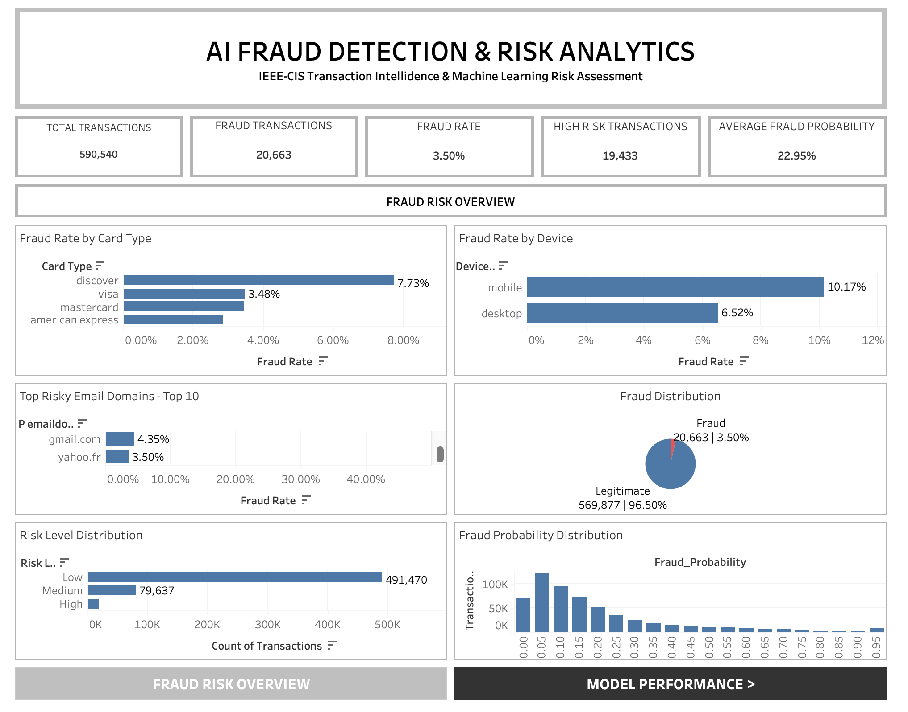
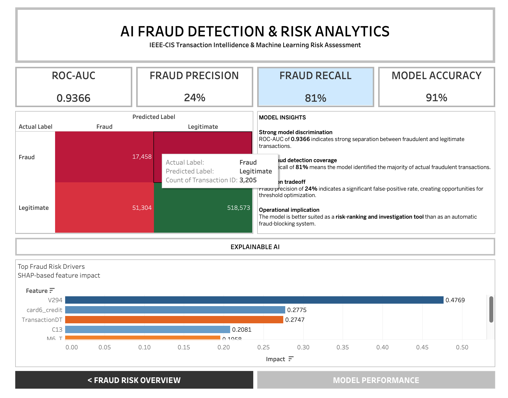

# AI-Powered Credit Card Fraud Detection & Risk Analytics Platform

## Dashboard Preview

## Business Problem

Credit card fraud creates significant financial risk for financial institutions. With fraudulent transactions representing a small percentage of overall transaction volume, identifying suspicious activity requires effective data analysis and machine learning techniques.

The challenge is to identify fraudulent transactions accurately while minimizing false positives that could negatively impact legitimate customers.

## Objective

Develop an AI-powered fraud detection and risk analytics platform that uses Python, SQL, machine learning, and Tableau to identify fraudulent transactions, evaluate transaction risk, explain model predictions, and provide actionable business insights.

## Assessment Scope

The project uses the IEEE-CIS Fraud Detection dataset to analyze approximately 590,000 transactions and identify patterns associated with fraudulent activity.

The assessment covers:

- Data cleaning and preparation
- Feature engineering
- SQL-based data analysis
- Machine learning using XGBoost
- Model performance evaluation
- SHAP-based model explainability
- Fraud risk analysis
- Tableau dashboard development

## Skills Demonstrated

# Coding Languages

- Python
- SQL

# Libraries

- Pandas
- NumPy
- Scikit-learn
- XGBoost
- SHAP
- Matplotlib
- Seaborn

# Database

- SQLite
- SQL data analysis
- Data transformation
- Relational data analysis

# Business Intelligence

- Tableau
- Dashboard development
- KPI development
- Data visualization
- Risk analysis
- Business insights

# Development Tools

- Git
- GitHub
- Visual Studio Code
- Python Virtual Environment

## Skills Demonstrated

- Data Cleaning & Preparation
- Exploratory Data Analysis
- SQL Analytics
- Feature Engineering
- Machine Learning
- XGBoost
- Fraud Detection
- Risk Analytics
- SHAP Explainable AI
- Data Visualization
- Tableau Dashboard Development
- Business Intelligence
- Data Storytelling

## Dashboard Highlights

- Fraud detection KPIs
- Transaction risk analysis
- Fraud risk distribution
- Model performance metrics
- Fraud detection trends
- High-risk transaction analysis
- Interactive Tableau visualizations
- Explainable AI insights

## Key Findings

- The dataset contains approximately **590,000 transactions**, with approximately **20,663 identified as fraudulent**.
- Fraudulent transactions represent approximately **3.5% of total transactions**, highlighting the highly imbalanced nature of the dataset.
- The XGBoost model achieved a **0.9366 ROC-AUC score**.
- The model achieved **81% recall for fraudulent transactions**, demonstrating its ability to identify a large portion of fraudulent activity.
- Fraud precision was **24%**, highlighting the challenge of minimizing false positives in fraud detection.
- Overall model accuracy was **91%**.
- SHAP analysis provided insight into the features contributing to individual fraud predictions.
- Tableau was used to translate machine learning outputs into an interactive business-focused risk analytics dashboard.